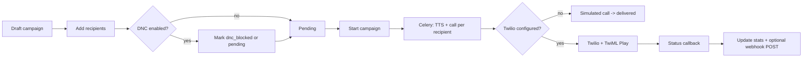

# VoxEngine

**AI Voice Pipeline & TTS Campaign Platform** — backend service for healthcare-style appointment reminders: text-to-speech generation, voice profiles, scheduled campaigns, do-not-call (DNC) enforcement, call tracking, outbound webhooks, and usage metering.

Backend-only, production-oriented layout: **no secrets in code**, configuration via environment variables.

---

## Architecture (ASCII)

```
                    +------------------+
                    |   REST API       |
                    |   (FastAPI)      |
                    +--------+---------+
                             |
         +-------------------+--------------------+
         |                   |                    |
         v                   v                    v
+----------------+  +----------------+   +---------------+
|  TTS Engine    |  | Campaign Mgr   |   | Usage Tracker |
| Edge-TTS /     |  | + recipients   |   | + quotas      |
| OpenAI API     |  | + DNC check    |   +-------+-------+
+-------+--------+  +--------+-------+           |
        |                    |                    |
        v                    v                    v
+---------------+    +-------+--------+   +---------------+
| Audio Storage |    | Celery queues  |   | PostgreSQL    |
| (local disk)  |    | tts/calls/web  |   | (metadata)    |
+---------------+    +-------+--------+   +---------------+
                             |
                             v
                    +--------+---------+
                    | Telephony        |
                    | Twilio (opt.)    |
                    | or simulated     |
                    +--------+---------+
                             |
              status callbacks / TwiML
                             v
                    +--------+---------+
                    | Webhook Delivery |
                    | (customer URL)   |
                    +------------------+
```

---

## Features by module

| Module | Responsibility |
|--------|----------------|
| **core** | Settings (`pydantic-settings`), async DB, JWT/password security, dependencies |
| **models** | Users (RBAC + API keys), voice profiles, TTS jobs, campaigns, recipients, DNC, usage, webhook deliveries |
| **schemas** | Request/response models for all endpoints |
| **services/tts_engine** | Pluggable TTS: **edge-tts** (free) or **OpenAI** via HTTPX |
| **services/campaign_manager** | Create campaigns, bulk recipients, start/pause, progress, DNC check, template rendering |
| **services/telephony** | Twilio outbound calls + TwiML `Play`, or **simulated** calls when Twilio is unset |
| **services/usage_tracker** | Per-action credits, period summaries, monthly quota check |
| **tasks** | Celery: `generate_tts_task`, `campaign_call_task`, `deliver_webhook_task` with queue routing |
| **api/routes** | Auth, voices, TTS, campaigns, DNC, usage |

---

## Voice profiles & TTS pipeline

1. Operator creates a **VoiceProfile** (engine + external voice id, language, optional sample path).
2. **TTS** requests resolve the profile, synthesize audio (Edge or OpenAI), store under `STORAGE_PATH`, and record **UsageRecord** entries.
3. **Campaigns** use a **message template** with `{{name}}`, `{{phone_number}}`, and custom `{{variables}}` from each recipient.

---

## Campaign workflow



---

## API endpoints

| Method | Path | Description |
|--------|------|-------------|
| POST | `/api/auth/register` | Register (first user becomes **admin**) |
| POST | `/api/auth/login` | JWT access token |
| GET | `/api/auth/me` | Current user |
| POST | `/api/auth/api-key` | Generate/replace API key (operator/admin) |
| GET | `/api/voices` | List voice profiles |
| POST | `/api/voices` | Create profile |
| GET | `/api/voices/catalog/available` | List provider voices |
| POST | `/api/voices/preview` | Generate preview audio |
| GET/PATCH/DELETE | `/api/voices/{id}` | CRUD |
| POST | `/api/tts/generate` | TTS (sync or `async_job` via Celery) |
| GET | `/api/tts/jobs` | List TTS jobs |
| GET | `/api/tts/jobs/{id}` | Job detail |
| GET | `/api/tts/jobs/{id}/audio` | Download MP3 |
| POST | `/api/campaigns` | Create campaign (optional `recipients[]`) |
| GET | `/api/campaigns` | List |
| GET/PATCH/DELETE | `/api/campaigns/{id}` | CRUD |
| POST | `/api/campaigns/{id}/start` | Queue calls |
| POST | `/api/campaigns/{id}/pause` | Pause |
| GET | `/api/campaigns/{id}/progress` | Aggregated stats |
| POST | `/api/campaigns/{id}/recipients` | Bulk add |
| GET | `/api/campaigns/{id}/recipients` | List recipients |
| POST/GET | `/api/campaigns/webhook-callback/twilio` | Twilio status callback |
| GET | `/api/campaigns/twiml/voice` | TwiML `Play` (validates `media_url`) |
| POST | `/api/dnc` | Add DNC entry |
| GET | `/api/dnc` | List |
| DELETE | `/api/dnc/{phone}` | Remove (admin) |
| POST | `/api/dnc/check` | Check number |
| GET | `/api/usage/summary` | Credits / characters / quota |
| GET | `/api/usage/history` | Raw usage rows |
| GET | `/health` | Liveness |

Authenticate with `Authorization: Bearer <token>` or `X-API-Key: <key>`.

---

## Tech stack

- **FastAPI**, **Uvicorn**, **Pydantic v2 / pydantic-settings**
- **SQLAlchemy 2 async**, **asyncpg**, **PostgreSQL**
- **Celery** + **Redis** (broker + result backend)
- **edge-tts**, **httpx** (OpenAI TTS), **Twilio** (optional)
- **JWT** + **passlib[bcrypt]**, **aiofiles**

---

## Project structure

```
app/
  main.py
  core/           # config, database, security, deps
  models/         # user, voice/campaign/tts/dnc/usage/webhook
  schemas/
  services/       # tts_engine, campaign_manager, telephony, usage_tracker
  tasks/          # celery_app, tts_tasks
  api/routes/     # auth, voices, tts, campaigns, dnc, usage
tests/
```

---

## Quick start (local)

```bash
cp .env.example .env
# Set SECRET_KEY (32+ chars) and DATABASE_URL

python -m venv .venv
.venv\Scripts\activate   # Windows
pip install -r requirements.txt

# Run from this project root so `app` resolves to VoxEngine (not another repo on PYTHONPATH).
cd /path/to/voxengine

# PostgreSQL must be running; then:
uvicorn app.main:app --reload
```

Celery worker (separate terminal):

```bash
celery -A app.tasks.celery_app.celery_app worker -Q tts,calls,webhooks,default -l info
```

## Docker Compose

```bash
cp .env.example .env
# Ensure SECRET_KEY is set in .env

docker compose up --build
```

API: `http://localhost:8000` · Docs: `/docs`

Shared **volume** mounts `STORAGE_PATH` so API and worker read the same audio files.

---

## Scaling notes

- Run **multiple Celery workers** per queue; tune `MAX_CONCURRENT_CALLS` and Twilio concurrency to match capacity.
- Use **managed PostgreSQL** and **Redis**; rotate `SECRET_KEY` and JWT expiry for production.
- Replace `init_db()` table creation with **Alembic migrations** for strict production rollout.
- Terminate **Twilio webhook** requests using **signature validation** (`X-Twilio-Signature`) before trusting callbacks.
- Front the API with a reverse proxy and enforce **HTTPS** so `PUBLIC_BASE_URL` and stored audio URLs are correct.

---

## CI/CD

This project includes GitHub Actions for continuous integration:

- **Lint**: Code quality checks with `ruff`
- **Test**: Automated test suite with PostgreSQL and Redis services  
- **Build**: Docker image build verification
- **Deploy**: Configurable deployment to AWS ECS/GCP Cloud Run (see `deploy` job in workflow)

## Observability

- **Structured Logging**: JSON-formatted logs with request tracing
- **Health Checks**: `GET /health` with dependency status (database, Redis, external services)
- **Metrics Ready**: Prometheus-compatible metrics endpoint structure
- **Error Tracking**: Structured error responses with correlation IDs

## Cloud Deployment

- **AWS ECS**: API + worker containers
- **AWS RDS**: PostgreSQL for campaign data
- **AWS S3**: Audio file storage with CloudFront CDN
- **AWS Polly**: Alternative TTS engine for enterprise deployments
- **Twilio**: Production telephony integration

---

## License

Portfolio / demonstration project — adapt licensing as needed for your deployment.
